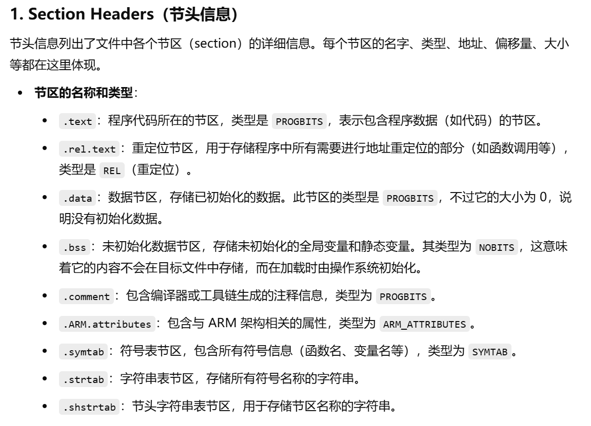
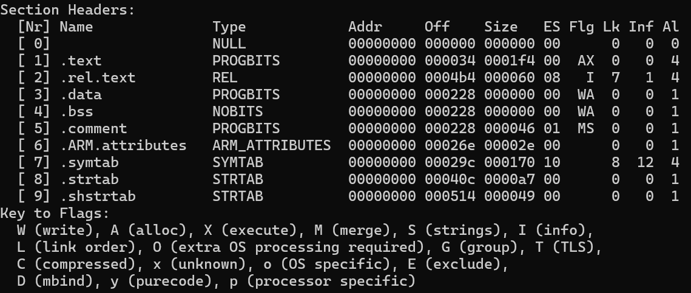
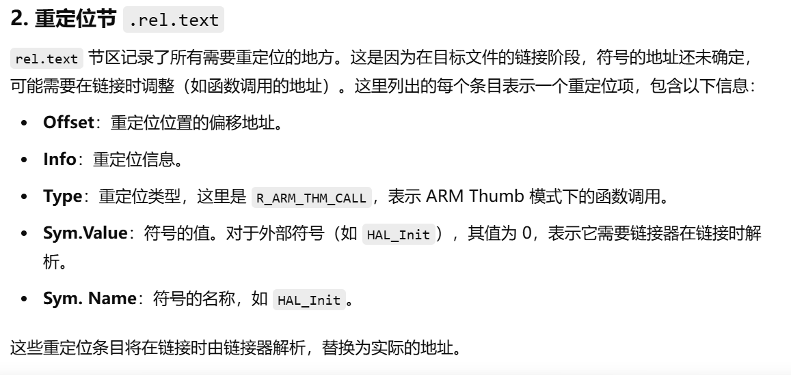
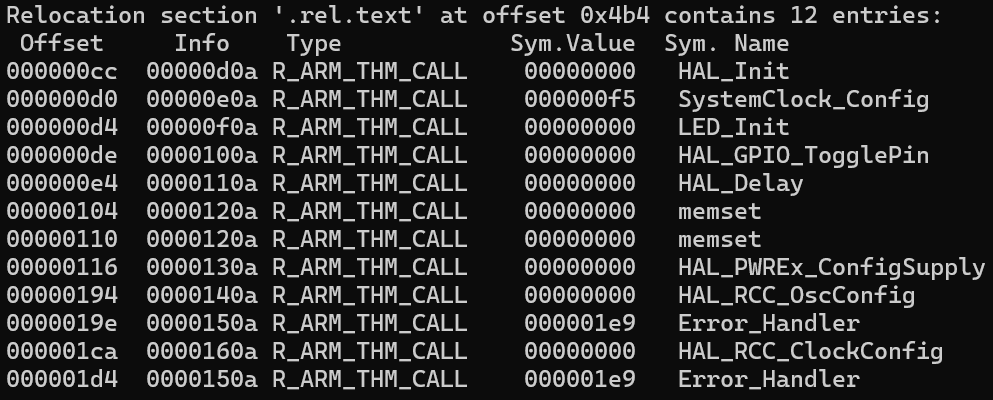
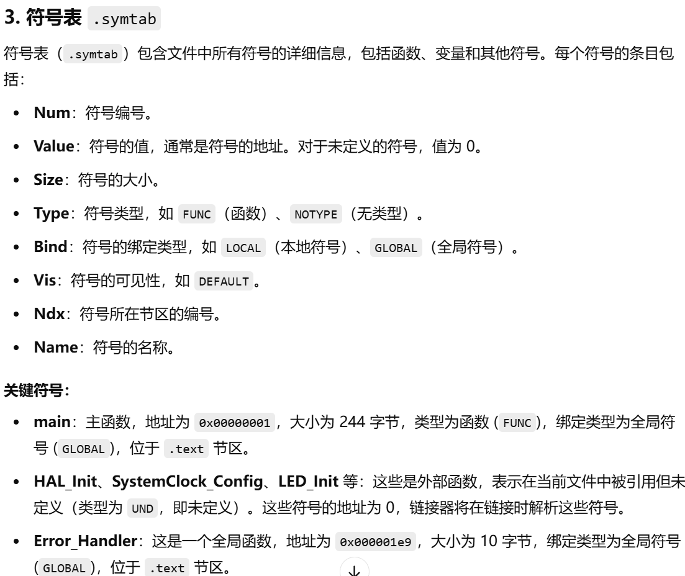
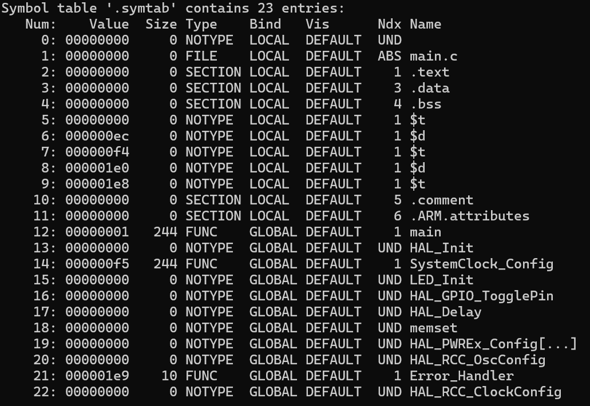
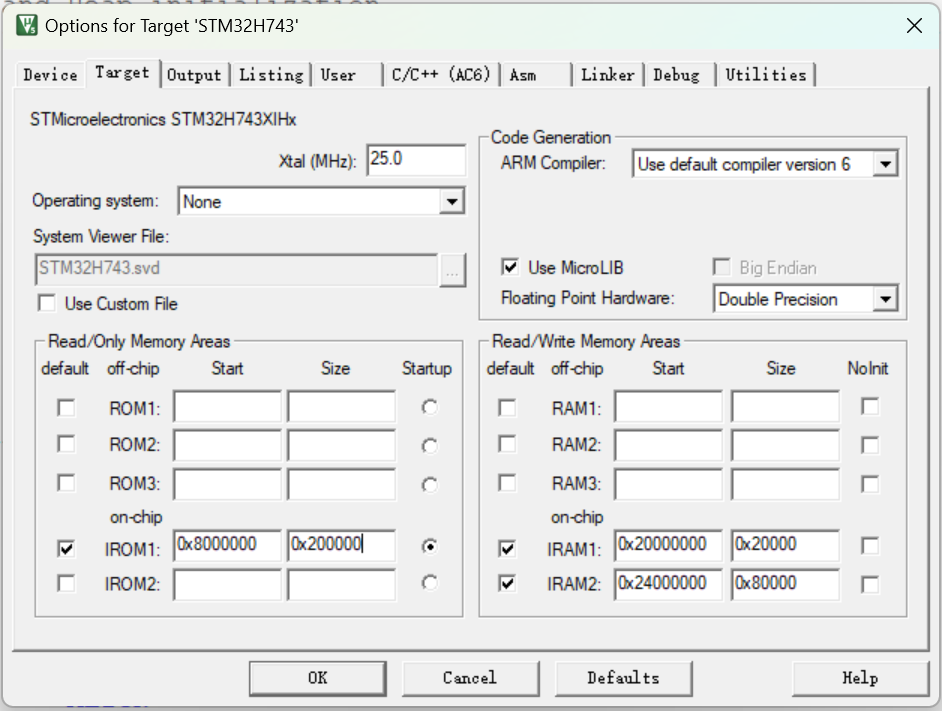
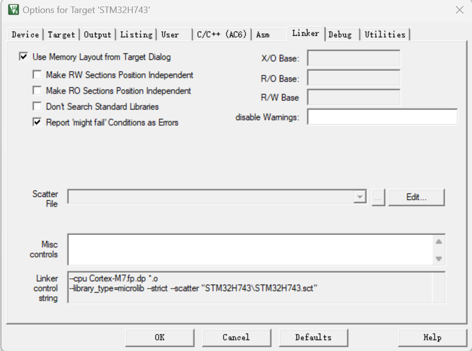

**此文档主要用于展开Keil隐藏的整个编译、链接、汇编过程**

# 工具链选择
在现代交叉编译的开发环境中，工具链的选择需要精准和高效。下面将介绍一些工具链的核心组件并且针对现代工具链的开发影响因素做一些简单介绍。
  
## 编译器
  现代编译器虽然没有国际组织对编译器开发做出一些规范，但是也自发地形成了两个主流的编译器框架，通过编译器框架，他们可以根据自己的需求开发更适配于自身产品的编译器。

  **编译器主要是针对特定的硬件架构进行优化，以生成高效地机器代码**；同时他还需要支持目标编程语言地最新标准和特性，以满足开发者的需求；不同的编译器在不同的方面--如性能、内存管理、其他资源占用等由不同程度的优化能力；同时还需要和我们选择的链接器、构建系统等兼容，以确保开发流程的完整流畅

  编译器的工作流程：词法分析、语法分析、语义分析、中间代码生成、代码优化、目标代码生成、链接与输出
  前三项工作是针对目标编程语言本身，以C/C++举例，根据不同的C/C++标准，会进行不同的前端分析。
  - 词法分析：会将代码流拆解为一个一个的符号，并且将其归类
  - 语法分析：会验证其中的一段代码流是不是一个正确的表达式组成、声明组成等，会生成一个语法分析树（AST）
  - 语义分析：会验证语法分析中的表达式是不是真的符合规范，比如会验证一个string = int + string。会生成符号表和增强的语法分析树（为符号加入类型、作用域等信息）
  - ------------------------------------------------------------------------------------------------------------------------------------
  - 中间代码生成与优化：到这一步其实也是平台无关的，中间代码生成会生成无关平台的类似于汇编代码的代码，以供接下来的代码优化使用
  - 目标代码生成：这是编译器的后端工作了，主要针对目标平台生成相应的汇编代码

  以下是我对该项目main.o的信息读取

  
  

  
  

  
  

## 链接器
  **链接器负责将编译后的目标文件合并（各种.o文件），处理符号解析和地址重定位，生成最终的可执行文件**；不同的链接器可能提供不同的功能，如支持动态链接库、优化代码布局等

  链接器的工作流程：输入文件收集和符号表构建、符号解析、地址空间分配与重定位、静态库与动态库处理、生成可执行文件
  - 输入文件收集和符号表构建：输入文件主要指自己创建的源文件经过编译生成的.o文件以及静态库(.a文件)和动态库(.so/.dll)文件。从每个目标文件中提取符号(之前通过编译器创建的符号表)并分为两类--一类是明确在源文件中实现的符号，如main函数，另一类是未定义符号，如printf函数等，需要从其他源文件或者库中引用的符号。静态库本质是多个目标文件的集合，链接器按照需求提取其中的符号。

  - 符号解析：为每个目标文件中的未定义符号找到唯一匹配的定义，解决跨模块的依赖关系。
    - 全局符号唯一性：同一个符号只能有一个强定义（比如函数实现），否则引发多重定义错误
    - 弱符号：允许同名符号存在，链接器优先选择强符号。
    - 如果静态库中的符号未被任何目标文件引用，该符号不会被链接到最终输出
  
  - 地址空间分配与重定位：合并所有目标文件并分配运行时地址，修正代码中的符号引用地址。
    - 地址空间布局：确定代码段(.text)、数据段(.data .bss)在内存中的起始地址(默认或者由链接脚本指定)
    - 重定位条目处理：每个目标文件包含重定位表(Relocation Table)，记录需要修正的代码位置(如调用printf的指令地址)
    - 链接器根据符号的最终地址，替换这些位置的占位值(一般是0x00000000)
    - 重定位一般分为PC相对寻址和绝对地址寻址

  - 静态库和动态库处理
    - 静态链接：静态库的代码直接复制到可执行文件中，符号解析在链接时完成，运行的时候不需要依赖外部库，但是体积很大，更新时更是需要借助工具链重新编译(所以有些工具链刚下载下来的时候，根目录下往往会包含一个build.sh脚本或者CMakeLists.txt用来本地编译静态库)
    - 动态链接：动态库的代码在运行时加载，链接器仅记录库名和符号名.
    - 全局偏移表(GOT)：存储动态库符号的运行时地址，首次调用时通过过程链接表延迟绑定？
    - 节省内存，支持热更新，但是以来环境配置

  在这里我需要提到的一点是，因为keil中采用的ARMCC/ARMCLANG编译器，并且一般来说并未采用链接脚本.ld，那么它为什么知道应该将代码烧录在哪里呢，文件结构又该如何组织呢？于是keil的设计开发者为我们提供了一个设计接口，如图
  
  但是ARMCC/ARMCLANG这整条工具链采用的是.sct格式的链接脚本，所以keil会根据这个配置生成一个.sct文件，这个可以在文件夹中去找到。
  但是不同的编译工具链会采用不同的链接脚本，所以呢，在做这个工作的时候呢，我们选用了gcc风格的汇编文件和链接脚本.ld，之后也会进行一个关于符合armgcc和armclang两种工具链的汇编文件和链接脚本的对比。
  所以呢这个链接脚本其实也就是我们说的**分散加载**的依据：不管是哪种工具链呢，都会根据我们的链接规定，在最后的文件中加入分散加载的代码片段，但是一般不会显示出现，所以只能在反汇编中去查看，像ARMCLANG似乎就是生成了一个__main，专门将堆栈指针初始化、数据拷贝、BSS清零(ARMCLANG中称为ZI段)以及为C/C++运行环境创造集成在__main里面；但是armgcc呢，就不想管那么多事，就直接把这个任务丢给了startup.s的编写人员，让他们直接把这些事都做了，所以在armgcc生成的elf文件中根本找不到__main这个符号。
  
  （哎哟，感觉自己废话真多，懒得打字了，意思应该表达到了）

## 汇编器
  **主要处理汇编源码，如startup.s文件，但是汇编器不针对目标平台的优化，而是将汇编代码转化为及其代码**

## 调试器
  **调试器主要根据他们的硬件架构--内核来做处理，一般来说debug的接口都在处理器内**

不同的工具链会存在不同的优化策略和库实现，优化策略会考虑架构，涵盖内存、运行性能等多方面，因此最终生成的指令也会存在不同，但是会保存逻辑的一致性。因此针对不同的处理器，我们需要根据最终的优化侧重选择不同的工具链。

## 关于现代工具链的开发
现代工具链的开发会考虑到很多方面的因素，但是主要也是针对处理器架构和特定生产厂家的设计，聚焦优化算法，来保证最终生成的机器码能够高效执行。
### 处理器IP拥有者
提供处理器的架构规范和技术文档，确保工具链能够正确支持处理器的特性
### 处理器生产厂家
根据处理器架构，设计和制造具体的处理器产品；与工具链开发者会形成合作，提供硬件特性和性能数据，帮助优化工具链的生成代码

  **关于处理器生产厂家针对所获取的IP核设计处理器的补充**
  1. 指令集架构，定义处理器支持的指令集：x86、ARM、RISC-V等，一般都是对指令的拓展（这个是和内核有关）
  2. 微架构设计：在指令集架构的基础上，设计处理器内部的结构和功能模块--如FPU、NPU、GPU等。包括流水线设计、缓存层次结构、分支预测、乱序执行等。不同的指令集可以通过不同的微架构实现。
  3. 制程工艺
  4. 功耗设计
  5. 多核和多线程设计
  6. 安全特性
  7. 输入输出接口
  8. 内存层次结构：设计多级缓存L1、L2、L3和内存控制器，以优化内存访问速度；支持不同类型的内存，如DRAM、SRAM等
  
  由于现代的工艺技术的进步，实现以上功能的模块基本上都集成在处理器内部，处理器内核会和他们做出交互。

3. 开发者社区和用户
  根据实际的应用需求和反馈，知道工具链的功能和性能优化

## Keil
我们可以在Keil的界面找到编译器选择的选项，但其实这个编译器并不区别工具链。因为Keil uVision中集成了4种工具链，以支持不同的处理器架构进行开发
1. MDK-ARM（Microcontroller Development Kit for ARM）--ARMCC
  专为ARM架构微控制器设计，支持Cortex-M、Cortex-R等内核。其编译器通常为ARMCC（ARM Compiler）或Clang，属于ARM专有工具链，与GNU的arm-none-eabi-gcc存在诸多差异。
2. Keil C51
  面向8051系列单片机，使用独立的C51编译器，与ARM工具链无兼容性
3. Keil C166 和 Keil C251
  分别针对C16x/C251架构，各自由独立的工具链支持，与ARM或8051工具链不通用
但是由于我们经常使用Keil进行ARM的开发，所以比较少的关注到另外几个工具链。

所以关于Keil的编译器选择：Default Compiler verison 5/6或者V5.26/V6.7这只是代表了不同的编译器版本，版本6是对版本5的升级，版本5经过了多年的优化，生成代码性能稳定、兼容性强，版本6则是基于LLVM技术（LLVM是一个开源的编译器基础设施项目，主要用于代码优化和生成，现在已经成为一个广泛应用的编译器框架），支持新的C/C++标准，提供了更强的优化能力。当我们选择不同架构的处理器时，即便选取的编译器版本相同，其keil底层运行的编译器是不同的。

接下来会对整个工具链的关键部分的配置做出一些说明，采用的项目是CubeMX生成的关于STM32H743的一个项目。
### 编译配置
编译器：ARMCLANG--Version 6
包支持：Keil.STM32H7xx_DFP.3.1.1
库支持：MicroLIB
预处理器定义：USE_HAL_DRIVER，STM32H743xx
语言支持特性以及代码生成
  1. Warnings:AC5-like Warnings
  2. C99 C++11
  3. Optimization:-Oz image size
  4. 未将警告转换为错误
  5. 链接时优化（×）
  6. Plain Char is Signed（×）
  7. Short enums/wchar（√）
  8. Split Load and Store Multiple（×）
  9. Read-Only Position Independent（×）
  10. use RTTI（×）
  11. One ELF Section per Function（√）
  12. Read-Write Position Independent（×）
  13. No Auto Includes（×）
头文件包含路径：文件构建的头文件目录
Misc Controls：无
编译器参数：
-xc -std=c99 --target=arm-arm-none-eabi -mcpu=cortex-m7 -mfpu=fpv5-d16 -mfloat-abi=hard -c
-fno-rtti -funsigned-char -fshort-enums -fshort-wchar
-D__MICROLIB -gdwarf-3 -Oz -ffunction-sections -Wno-packed -Wno-missing-variable-declarations -Wno-missing-prototypes -Wno-missing-noreturn -Wno-sign-conversion -Wno-nonportable-include-path -Wno-reserved-id-macro -Wno-unused-macros -Wno-documentation-unknown-command -Wno-documentation -Wno-license-management -Wno-parentheses-equality -I ../Core/Inc -I ../Drivers/STM32H7xx_HAL_Driver/Inc -I ../Drivers/STM32H7xx_HAL_Driver/Inc/Legacy -I ../Drivers/CMSIS/Device/ST/STM32H7xx/Include -I ../Drivers/CMSIS/Include -I ../Drivers/User/Inc
-I./RTE/_STM32H743
-ID:/Keil5/ARM/PACK/ARM/CMSIS/5.9.0/CMSIS/Core/Include
-ID:/Keil5/ARM/PACK/Keil/STM32H7xx_DFP/3.1.1/Drivers/CMSIS/Device/ST/STM32H7xx/Include
-D__UVISION_VERSION="524" -D_RTE_ -DSTM32H743xx -DUSE_HAL_DRIVER -DSTM32H743xx
-o STM32H743/*.o -MD

### 汇编配置
条件汇编控制符号：无
语言支持特性和代码生成：
  1. 未使用ArmClang V6
  2. Read-Only Independent and Read-Write Independent均为开启
  3. Thumb Mode未开启
  4. Split Load and Store Multiple未开启
  5. 会发出警告
  6. No Auto Includes未开启
包含路径：无
Misc Controls：无
汇编器控制参数：
--cpu Cortex-M7.fp.dp -g --pd "__MICROLIB SETA 1"
-I.\RTE\_STM32H743
-ID:\Keil5\ARM\PACK\ARM\CMSIS\5.9.0\CMSIS\Core\Include
-ID:\Keil5\ARM\PACK\Keil\STM32H7xx_DFP\3.1.1\Drivers\CMSIS\Device\ST\STM32H7xx\Include
--pd "__UVISION_VERSION SETA 524"
--pd "_RTE_ SETA 1"
--pd "STM32H743xx SETA 1"
--list *.lst
--xref -o STM32H743\*.o
--depend STM32H743\*.d

### 链接配置

### 输出配置
Linker Listing
  Memory Map：内存映射，提供了程序在内存(RAM and ROM)中的具体布局
  Symbols：列出程序中定义的所有符号（变量、函数等）
  Size Info：显示程序各个部分（如代码段、数据段等）的大小
  Totals Info：显示程序总体大小（包括代码和数据段的总和）
  Callgraph：显示程序中函数调用的图形表示。
  Cross Reference：查看某个符号在程序中的所有引用位置
  Unused Sections Info：显示程序中没有被使用的部分
  Veneers Info：修饰符信息，修饰符是链接器插入的小段代码，用于处理某些操作，比如跳转表或间接调用。

Assembler Listing
  Cross Reference

C Compiler Listing和 C Preprocessor Listing(这两个没配置)

## 个人选择
关于我们个人选择的话，就需要根据目标架构进行选择就行。

其实对于一些还挺有实力的生产厂家来说，他们设计的芯片会附带提供开发工具链，比如之前用到的Rockchip RV116g的芯片，luckfox公司采用了这款处理器来设计了多款MCU，我们使用的就是luckfox-pico-ultra-W。Rockchip就集成了一个支持很多Rockchip生产的处理器芯片的开发工具链。针对ARM公司提供的不同IP核，设计了RK3588八核处理器。

像ARM公司的话，他虽然不生产处理器，知识把IP核卖给处理器生产厂家，下面的处理器生产厂家就提供了各种各样的工具链来支持用户对自己的处理器进行开发。

我们就选用了一个比较通用的嵌入式工具链，能够在编译时自己定义处理器架构，并且能够搭配一些与其微架构相关的参数，让编译得到的机器码的执行性能能够更高。

### 编译配置

### 链接配置
