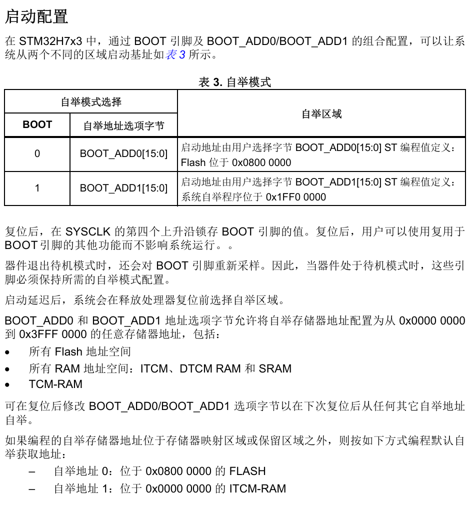

**此篇启动流程的解析建立在没有MMU，针对STM32H743，并未做出普遍性验证**

## 硬件流程
上电复位，复位电路释放NRST复位引脚，复位信号触发，内部电源、时钟、寄存器状态复位到默认值

硬件自动加载SP和PC，从逻辑地址的0x00000000和0x00000004去将SP和PC的值加载出来

## 软件流程
软件流程我将分为有bootloader和没有bootloader的启动版本，bootloader我准备使用ST提供的bootloader，待后续实验完成后，我会加上自定义bootloader启动的流程梳理

### 无bootloader
没有bootloader的启动流程实在过于简单

PC被0x08000004处的指令填充，开始取指执行代码
初始化栈指针-->ExitRun0Mode(configure the power supply)-->SystemInit(clock system initialization function)-->复制.data(rw)至SRAM-->将.bss段清零-->__libc_init_array(初始化C运行时库)-->转至main函数正式开始执行应用程序

### 有bootloader
关于ST提供的bootloader，bootloader里面做了什么还有待我去阅读文档，但是也会在bootloader结束的时候转到我的Reset_Handler

## 自定义起始地址--RAM执行代码
关于为什么CPU知道去0x08000000取SP和PC，这是根据ARM规范来的

一般都是选择BOOT 0嘛，从0x08000000启动，当然他也提到了我们可以修改选项字节以达到从不同的地方进行启动。

所以我在这里简单叙述一下怎么进行如何修改，deepseek给我提供了两种方式
  1. 通过STM32CubeProgrammer的图形化界面，找到Option Bytes修改Boot Address
  2. 通过STM32CubeProgrammer的命令行直接去修改
  3. 通过软件的方式去修改，但是这个风险比较大，一不小心配置错误会造成芯片锁死，所以仅在调试阶段使用比较好

上电后，我们仍然从0x08000000进入代码的执行，但是我们在这里放入了一个轻量的bootloader，他所做的只是为了在一次重新上电后，将FLASH中的代码重新copy到RAM中去，并重新设置SCB->VTOR，让程序运行过程中若有中断触发能够找到准确的中断向量表。所以我们在这里需要在FLASH中设置一小段引导程序将代码加载到RAM同时让PC能够转移到那边去，这个时候因为我不需要考虑固件升级，因为这个bootloader我打算和我的程序放在一起，并且为他单独定义一个段，所以在我升级我的程序的时候不需要bootloader来检测。

那么就有人问了，主波主波，你这个RAM不是掉电就没了吗？有没有那种简单又持久的方式啊？那主播也只能告诉你无的兄弟无的，啥好事儿都让你占完了咋能够呢。
这里的bootloader不太适合加入软件修改BOOT_ADD0，因为这样每次复位虽然能够直接到我指定的地址去直接开始执行代码（因为第一次上电我的bootloader已经帮助我将代码拷贝过去了，复位并未掉电，RAM中的代码仍然保持），所以这极有利于调试。但是掉电后，由于BOOT_ADD0是存储在非易失性的介质中，而RAM掉电后，程序消失，下一次上电，硬件会直接将RAM中的配置位置处的内容加载到SP和PC，那这个时候RAM中啥也没有，那你不炸了吗？

