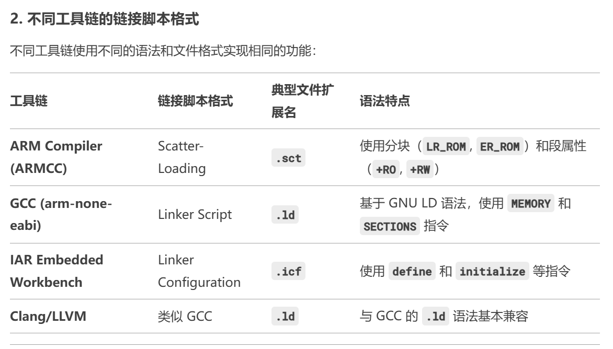
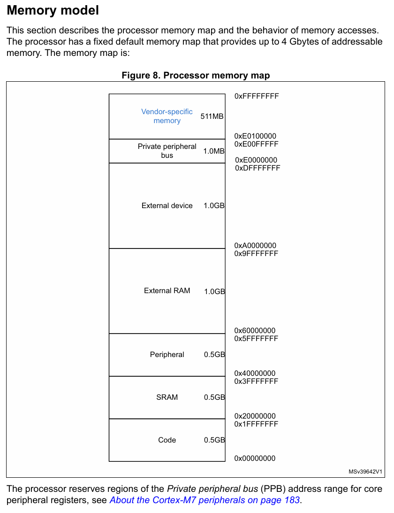

**咋说呢，这一篇算是对编译器和链接器的一个简单延伸？最重要的还是解析链接脚本**

**链接脚本的分类**

# .ld文件梳理
这个文件的构成可以查看我们根目录下的Scripts/stm32h743xi_flash.ld
主要的构成还是MEMORY和SECTIONS
## MEMORY
这个东西用于定义存储器的范围和属性
关于范围就不多说，关于属性提一嘴，r表示可读，w表示可写，x表示可执行
这个不涉及具体的段布局，不会自动决定某个section放在哪个MEMORY里

## SECTIONS
用于定义代码和数据的布局，本质上就是做了一个可执行文件的各个SECTION的加载域和运行域到MEMORY的映射
所以这玩意儿得先做一个映射才能重定位，对最终可执行文件的确定有重要作用

## 对stm32h743xi_flash.ld的具体解析
我先对嵌入设备比较常用的FLASH启动进行分析

### Part 1
定义了ENTRY_POINT，这个部分有待补充，因为我好像对上电后为什么会直接到入口有点疑惑，还需要一点硬件层面的梳理

_estack : 0x24080000
_Min_Heap_Size : 0x200
_Min_Stack_Size : 0x400 
由我们自己定义应用层可以开辟多大的动态空间和使用多大的栈

### Part 2
这部分是MEMORY，也没有什么大的问题，就是很显而易见的东西，我贴一张关于STM32H743XIH6的内存映射图

也可以看到，这样子定义的话，对Linker可见的内存部分也就是这定义的一点，并且还给我们做了预留，方便我们将某些数据或者代码拷贝到RAM去

### SECTIONS
#### .isr_vector
ALIGN(4)在前后都用了，也就是说isr_vector前后要保持4字节对齐
KEEP告诉链接器这一段不要优化掉
>FLASH 这就是告诉加载运行域都在FLASH

#### .text
同样前后保持4字节对齐
glue_7和glue_7t有点类似于操作系统中的上下文切换部分，glue_7是ARM指令集转Thumb指令集时的一个过渡代码，提供对寄存器的修改、恢复等工作，glue_7t就是反过来Thumb转ARM的一个过渡代码。另外多提一句，这个是由链接器生成的
.eh_frame这一段不太重要，暂时预留不解释了
_etext代表代码段结束地址，这个单独拎出来可能是为了做一个区分，gpt给出的解释是在初始化数据拷贝时可能会用到
同样加载域和运行域都在FLASH

#### .rodata
只读数据的存放位置，常量数据都放在这里，但是关于之前我记得好像有一个关于常量数据放在堆里面的说法，还有待考究

#### .ARM.extab C++异常处理表
#### .preinit_array .init_array .fini_array C++构造函数/析构函数
#### .data
这里首先有一个_sidata，拿给startup.s用的
然后需要初始化的数据放在这里
然后这里还存放着运行在RAM的代码，但是我查看生成的ELF文件后没有发现有任何运行在RAM的代码，这个后续需要研究一下能不能直接借助它的这个配置去实现中断函数代码放置到RAM中去
#### .bss
就是未初始化的全局变量和局部静态变量的放置的地方

#### .user_heap_stack
这个地方为堆栈预留了空间
PROVIDE的两条命令就是定义了全局符号，他们的值等于当前链接地址.，即程序映像的结束地址？关于这俩的用途：1.动态内存管理 2.调试目的 3.启动代码，有些情况下裸机或嵌入式系统的sbrk()需要知道堆的起始地址，_end就是一个常见选择

#### /DISCARD/
作用是移除标准库libc.a libm.a libgcc.a中未使用的符号，优化最终生成的文件大小

#### .ARM.attributes
特殊的ARM片段，存储一些ARM架构相关的元数据

**补充一下关于整个文件最后的组织，如果不特别说明呢，ELF文件的组织顺序就是按照链接脚本中的SECTIONS的出现顺序组织了**