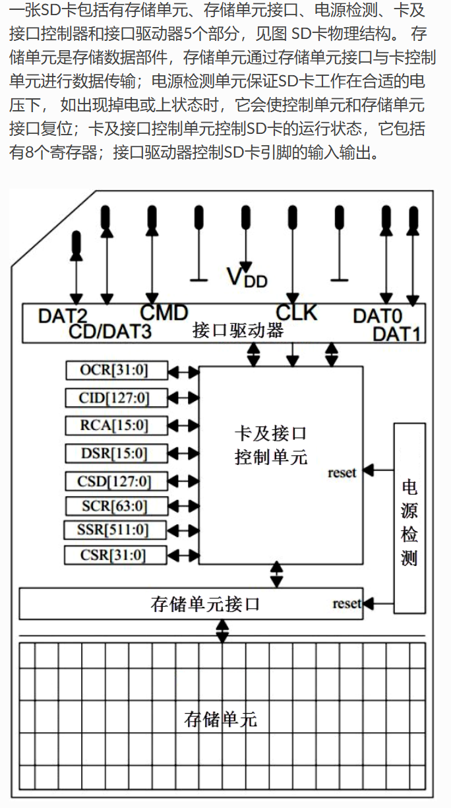

**此文档用于介绍整个工程基于SD卡移植FATFS，将包含SD卡的驱动开发**

**Note：使用SDIO通信，未使用SPI通信**

**我发现HAL库实在有点乱，并且还需要我自己去定义一些宏（当然这个宏有可能已经被设置在某个地方但是我的工程没有引入），所以我决定自己阅读SDMMC、MDMA、IDMA的相关文档并且借助AI帮助我进行整个工程的配置**

## SD Driver Development
### SD卡的物理结构

我们可以非常清晰地看到关于整个SD卡的结构，当然其工作模式也显而易见。

### SD卡总线
#### SDIO通信时序
不管是哪方向对方传数据，都以CLK的上升沿为有效，整个SD卡操作过程只会使用两种不同频率的时钟同步数据--一是识别卡阶段使用FOD，最高为400KHz，二是数据传输模式下时钟频率FPP，默认最高为25MHz，但是可以配置其在50MHz

#### 总线协议
  SD总线通信基于**命令和数据传输**。一般情况下是主机发起命令，从机响应，并伴随数据传输

  SD数据是以**块形式**传输，SDHC卡数据块长度一般为512字节，数据可双向，并附带CRC位，CRC位由SD卡系统硬件生成。STM32控制器可以控制使用单线或者四线传输。

  SD数据传输支持单块和多块读写，分别对应不同的操作命令，多块写入还需要使用命令来停止整个写入操作。**数据写入前需要检测SD卡忙状态，因为SD卡在接收数据后编程到存储区过程需要一定操作时间。SD卡忙状态会把D0拉低来表示。**数据块读操作与之类似，只是不需要忙状态检测。

  四线传输时，每次传输4bit，每根数据线都必须有起始位、终止位以及CRC位，每根数据线都会单独检查CRC，并且将四线检查结果汇总通过D0反馈给主机。

  SD卡数据包由两种格式，8位宽数据包传输和宽位数据包格式。8位宽在4线同步发送时，每根线发送一个字节的其中两位。宽位数据包专门针对SD卡SSR今存其内容发送。

### 命令响应解析
#### 寄存器
1. SCR寄存器：保存SD卡的特殊性信息--支持的总线位宽、SD卡版本等
2. CSD寄存器：SD卡的相对地址
3. OCR寄存器：SD卡的可供电范围，并且区别是否为HC卡（OCR响应第30位）
4. CID：SD卡的唯一ID号
5. SD卡的插入检测一般都是对应的中断触发引脚，作为检测当前SD卡有没有被插入卡槽
#### CMD命令
CMD0：当前指令位，进入空闲状态
CMD1：读OCR寄存器，获取OCR寄存器的必要信息
CMD2：验证SD卡是否介入，长反馈CID
CMD3：读取SD卡是否介入RCA，短反馈
CMD4：SDIO不支持DSR
CMD6：在第一部分v1.10中添加了部分强制服务
CMD7：使能SD卡，如果参数值为0，即使取消所有选中SD卡，根据获取指定的RCA，选中SD卡。如果在选中一个卡的状态下，又选中其他卡，那么之前的卡会自动取消选中，如果发送地址为0，表示取消选中全部卡
CMD8：CRC校验值和发送值相同，说明当前SD卡支持SD2.0协议
CMD9：读取CSD寄存器获取卡的相关信息，获取SD相关的存储信息--块大小、容量等
CMD10：读取CID信息
CMD12：强制停止所有传输，停止多块传输操作
CMD13：获取卡的状态，本质就是读取Card Status
CMD16：设置SD卡的块大小
CMD17：设置SD卡按照单个区块进行操作，使SD卡进入传输状态，读取单个块。需要附带对应的地址参数，按照整块读出
CMD18：设置SD卡按照多块进行操作，使SD卡进入传输状态，读取多个块，直到收到CMD12为止
CMD24：使SD卡进入传输状态，写入单个块
CMD25：使SD卡进入传输状态，写入多个块
CMD27：写CSD寄存器的数据（不建议）
CMD28：设置写保护块的地址
CMD29：擦除写保护块的地址
CMD32：设置擦除块的起始地址
CMD33：设置擦除块的终止地址，作为连续擦除机制使用
CMD38：擦除所选择的块
CMD55：特殊指令前命令，发送ACMD类指令前，需要发送此命令

#### ACMD命令
ACMD6：设置SD卡的总线位宽，这个需要读取SCR确定
ACMD13：SD卡状态
ACMD41：获取SD电压值，作为测试当前SD卡的支持协议，所需的电压值是否正常
ACMD51：获取SD卡的SCR寄存器的值

## 无DMA配置
第一版在没有DMA辅助的情况下进行操作。

### SDMMC1外设初始化--SDMMC1_Init
1. 打开GPIO时钟和SDMMC1外设时钟
2. 配置GPIO引脚复用
3. 配置SDMMC1
  - 复位SDMMC1
  - 电源上电
  - 时钟配置：禁用硬件流、四位数据宽、时钟线始终使能、先对CLK分频为200KHz
  - 关闭数据长度并且禁用数据通道

### SD卡初始化--SDMMC1_SD_Init
以下是SD Association提供的关于初始化和进入SD mode的流程，其中提到发送CMD3并且卡响应后便脱离卡识别阶段，进入旁路模式(standby)

但是我选定的卡是UHS-I的，所以他们针对UHS-I的卡有新的流程，如下

1. 发送至少74个时钟周期的数据
2. CMD0复位
3. CMD8检查电压范围和SD版本
4. CMD55+ACMD41检查是否已经准备好
5. 根据ACMD41响应值ocr判断是否支持1.8V电压，若支持执行CMD11切换电压以支持更加快速的读写
6. CMD2读取CID
7. CMD3分配RCA（SD模式）
8. CMD7选择卡
9. CMD55+ACMD6使能4bit传输
10. 回调时钟为20MHz，识别卡阶段全部完成开始读写
11. IdleClock进行同步，防止时序错误

### SDMMC1命令发送--SDMMC1_SendCMD
1. 清除所有中断标志
2. 设置命令参数
3. 设置命令寄存器--设置CMD、是否需要等待响应、是否是数据传输命令、开启CPSM状态机
4. 等待命令传输完成，超时返回-1
5. 如果需要等待响应则等待响应，响应超时为64个SDMMC_CK时钟周期

### SD卡擦除--SD_Erase
1. CMD32设置起始擦除地址
2. CMD33设置结束擦除地址
3. CMD38正式触发擦除数据的操作
4. 查询SD卡状态直到可用返回

### SD卡单块写数据--SD_WriteSingleBlock
由于需要手动管理数据，所以需要我们自己去填充FIFO
1. 设置DLEN、DTIMER、DCTRL（设置方向，定义数据块大小512字节）
2. 发送CMD24命令单块写入操作
3. 等待数据发送FIFO有足够空间
4. 向数据发送FIFO中写入数据
5. 等待数据传输完成（这一步可能后面可以优化一下）

### SDMMC写FIFO--SDMMC1_WriteFIFO
每次写入一个数据块--512字节
轮询STA的SDMMC_STA_TXFIFOHE位，每次半空则可以写入数据，每次写入uint32_t

### SD卡单块读数据--SD_ReadSingleBlock
由于需要手动管理，所以需要自己去读取FIFO
1. 设置DLEN、DTIMER、DCTRL
2. 发送CMD17
3. 等待数据接收FIFO有足够数据可读
4. 从数据接收FIFO中读取数据
5. 等待数据传输完成--DATAEND置1--这一步好像有点多余，后面再优化吧

### SDMMC读FIFO--SDMMC1_ReadFIFO
每次读取一个数据块--512字节
轮询STA的SDMMC_STA_RXFIFOHF位，每次填充一半即可从中读取数据，每次读取uint32_t

### 关于命令响应
R1:短响应，响应数据为Card Status
R1b:短响应，响应数据为Card Status，但是这个响应会同时将D0拉低以表示自己正在忙
R2:长响应，响应数据为CID或者CSD的内容
R3:短响应，响应数据为OCR寄存器的内容，作为ACMD41的响应
R6:短响应，但是这个响应数据需要进行拆分，所以在此贴一张图以更加直白地看懂

R7:短响应，作为CMD8的响应

关于Card Status，需要做一个解释

### MDMA的补充
关于MDMA，主机直接存储器访问，用于在存储器与存储器之间或外设与存储器之间提供高速数据传输。
MDMA控制器提供一个AXI主控总线接口，用于主存储器和外设寄存器访问；提供一个HAHB主控总线接口，该接口只适用于Cortex-M7 TCM存储器访问

总体结构较为简单，请求发送至MDMA，经过仲裁器仲裁后，开启数据传输

单次请求传输得数据数组长度为以下长度之一
1. 缓冲区传输大小
2. 块大小
3. 重复块
4. 完整通道数据（直至通道的链表指针为空）

对于每个通道，有三种数据数组长度非常重要
1. 突发大小：此为可在突发模式下执行的数据传输长度。此突发长度定义了不能被总线仲裁中断并且可阻止其他主设备访问该总线的数据传输最大长度。
2. 缓冲区传输大小：此为在检查其他通道的MDMA请求之前，要在某个通道中传输的数据数组长度。在该长度范围内的数据传输时，不能够被其他MDMA通道请求所中断。
3. 块大小：主要功能是在MDMA链表的块结构中说明数据块的长度（链表中的一个条目）；如果TRGM为01，则该长度为在单次MDMA请求激活时传输的数据数组长度

所以这对应了每个通道的几种传输形式
1. 单块传输，传输一个块。在块传输结束时，会禁止DMA通道，并会生成通道传输结束中断。
2. 重复块传输：在禁止相应通道前，传输大量块
3. 链表传输：当前数据块（或重复模式下的最后一个块）的传输完成后，会从存储器加载新块控制结构，并会开始新块传输

每一个MDMA请求传输的最小数据量（缓冲区大小，最高128字节）。一个块中的总数据大小是可编程的，最大为64KB。每次传输后，该值都会递减。此计数器达到0时，即表示达到块末尾，并会根据重复传输计数器（针对重复块传输）和/或链表结构值决定下一步操作

如果块长度不是缓冲区长度的倍数，则块中的最后一次缓冲区传输变短，其中包含要在当前块中传输的剩余字节。

#### 关于MDMA缓冲区传输
这是我们使用FATFS采用的方式
发生一个MDMA请求事件时，在一个通道上传输的数据的最小逻辑量（最多128字节）。

MDMA缓冲区传输包括一系列给定数据量传输（以单次或突发数据传输的形式进行）。要传输的数据项的数目及其宽度可用软件编程。用于数据传输的突发长度也可独立编程。

在产生数据传输请求事件后，DMA/外设会向MDMA控制器发送请求信号。MDMA控制器根据通道优先级处理该请求。如果掩码地址寄存器已经设置，向掩码寄存器指定的地址写入掩码数据时就会确认这个请求，如果未设置，则向该外设读取/写入数据即可复位请求。此时，如果由目标外设完成请求，则必须将写入操作设为不可缓冲，以避免出现错误的新MDMA请求。在MDMA请求之后当前通道需要传输的数据总量由TRGM字段决定。如果为00，MDMA会在一个缓冲区的数据传输完成后在同一个通道上等待另一个请求。

#### 关于块传输
为什么也需要介绍这一种传输，因为我暂时对这种模式的传输和缓冲区传输有点分不清
块为连续的数据数组，最多支持64KB，通过连续缓冲区传输实现传输。
OK，写到这里我突然明白了，缓冲区传输是一个单位操作，任何的传输模式都是建立在缓冲区传输之上的，或者说都是由缓冲区传输组成的。

每个数据块均由起始地址和块长度进行定义。完成块传输后，可执行以下三种操作之一
1. 当前块为重复块传输的一部分：重载块长度，以及计算新块起始地址（基于MDMA_CxBRUR寄存器中的信息）
2. 块为单块或重复块传输中的最后一个块：从存储器加载下一块的信息（使用MDMA_CxLAR中的链表地址信息）
3. 块为需要针对当前MDMA通道传输的最后一个块（MDMA_CxLAR=0）：通道被禁止，且不会为该通道接受更多MDMA请求

我们也主要使用块传输每次传输512B的一个Sector的大小

### 整个流程中所遇到的问题
1. CMD8命令发送时，进入了HardFault，经排查是因为在发送命令的函数中一定会检查CMDSENT，但是这个标志位只有当无响应命令发送时才会置1
2. 发送CMD55后发送ACMD41进入HardFault，经检查后发现CRC校验未通过，但是不清楚原因，后添加了CMD55响应的确认、改变了ACMD41的发送参数，便能够正常运行，所以后续还需要探索一下CRC机理，对CRC校验失败的响应情况做一个处理。
3. 无法读写数据块
4. MDMA没有开启传输，但是标识置位，简直逆天
5. 经过考虑后我认为整个过程关键的耗时就在写FIFO，所以就直接软件置位开启对这个通道的请求了，不用考虑硬件的触发源了，真麻烦。

### 问题解决
1. 关于初始化流程，参阅本Docs文件夹中的PDF后，可以非常明晰地知道，在上文中我也截取了关于SDXC卡的初始化流程，在调试过程中多次观察SD卡的response后确认初始化流程正确且成功
  - 另增加了一个关于电压切换的步骤，CMD11，但是从SD卡的response来看，这张卡是不支持1.8V的工作电压的，所以这个步骤未能起到作用
2. 关于写操作，之前一直对FIFO操作的细节出了一点问题，就后续的解决来看，第一次填充似乎必须填充满FIFO才能开始启动传输，后续则是根据它的计数器和FIFO有无内容来决定是否继续传输。读操作同样也是这个问题，只有当它达到一个界限才能开始读取，后续根据它的计数器和FIFO有无内容来决定是否继续读取
3. 关于测试方法
  - 先建立一个初始化过的缓冲区，数据单元存储的内容和索引相同
  - 初始化SD卡
  - 确认初始化成功后像SD卡的某块存储区域写入该缓冲区的内容，一共512字节
  - 将缓冲区全部清零
  - 从之前写的那个地址块读取数据出来至缓冲区
  从调试结果来看，完全符合预期，缓冲区又重新填充了和索引相等的数据

至此，关于SD卡的初始化及读写搞定，但是实验顺利，所以暂时未对一些错误情况进行考虑和处理，基本只对数据或者命令超时有进行一定的处理，所以后续还有待完善

## FATFS Transplant