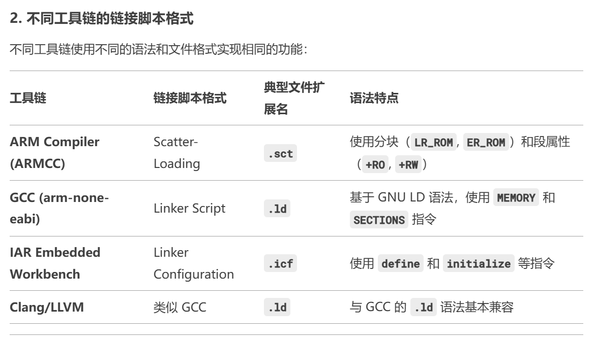
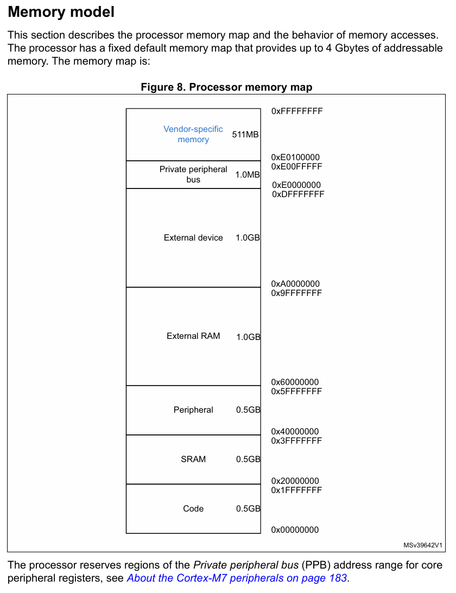
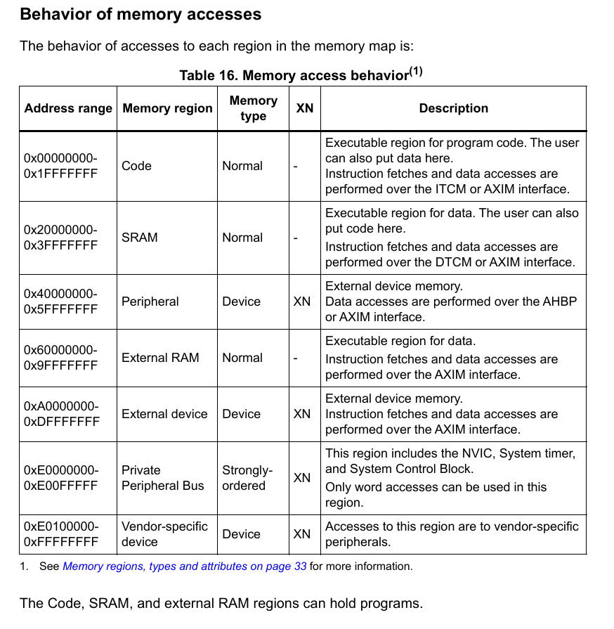
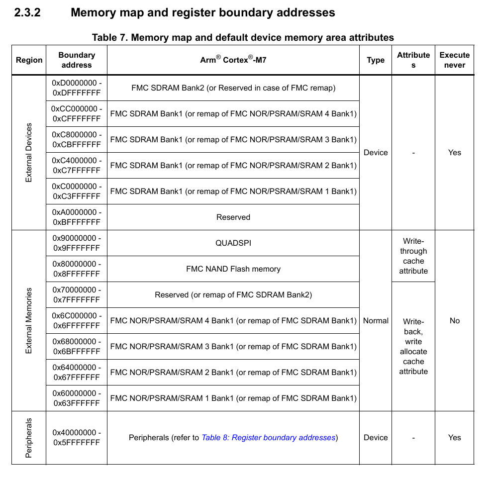
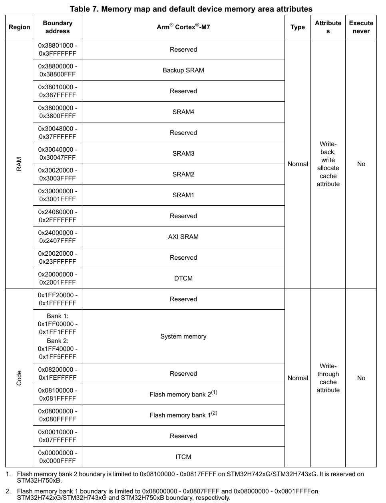

**咋说呢，这一篇算是对编译器和链接器的一个简单延伸？最重要的还是解析链接脚本**

**链接脚本的分类**

# .ld文件梳理
这个文件的构成可以查看我们根目录下的Scripts/stm32h743xi_flash.ld
主要的构成还是MEMORY和SECTIONS
## MEMORY
这个东西用于定义存储器的范围和属性
关于范围就不多说，关于属性提一嘴，r表示可读，w表示可写，x表示可执行
这个不涉及具体的段布局，不会自动决定某个section放在哪个MEMORY里

## SECTIONS
用于定义代码和数据的布局，本质上就是做了一个可执行文件的各个SECTION的加载域和运行域到MEMORY的映射
所以这玩意儿得先做一个映射才能重定位，对最终可执行文件的确定有重要作用

## 对stm32h743xi_flash.ld的具体解析
我先对嵌入设备比较常用的FLASH启动进行分析

### Part 1
定义了ENTRY_POINT，这个部分有待补充，因为我好像对上电后为什么会直接到入口有点疑惑，还需要一点硬件层面的梳理

_estack : 0x24080000
_Min_Heap_Size : 0x200
_Min_Stack_Size : 0x400 
由我们自己定义应用层可以开辟多大的动态空间和使用多大的栈

### Part 2
这部分是MEMORY，也没有什么大的问题，就是很显而易见的东西，我贴一张关于STM32H743XIH6的内存映射图

~~也可以看到，这样子定义的话，对Linker可见的内存部分也就是这定义的一点，并且还给我们做了预留，方便我们将某些数据或者代码拷贝到RAM去~~
之前我有一点误解，看了内核编程手册的Memory Model和Reference Manual的内部SRAM的讲解，这张图其实并不是说实际上有这么多空间可用，只是这些相应的设备可映射区域有这么多罢了

这张图定义了一些行为，我们主要关注的就是data access和instruction fetch，并且还要关注它们是通过什么总线进行获取的，这至关重要。

另外我还想提一句，关于裸板可用内存的model最好还是查看英文原版手册，不要为了方便查看中文手册，不然有些细节会对你的工作造成极大的困扰。这里查看英文原版手册，可以看到更为详细地关于内存映射的分布。

~~**_这个地方导致了我之前实验将代码准备复制到0x30000000也就是SRAM1的失败，因为内核访问SRAM1-SRAM4都是通过AHB总线矩阵，而对SRAM区域的行为定义是通过DTCMRAM和AXI总线进行指令和数据读取_**~~

### SECTIONS
先提出两个概念：输入段和输出段
输入段：也就是各.o文件中的各段
输出段：最终形成的ELF文件中的各段

#### 全局变量
- .代表当前位置。当然大家也能注意到.既存在于{}内，也存在于{}外。{}内的.代表这个段运行域的当前地址；{}外的.代表加载域的当前位置（不知道你们理解没，但是我现在写文档很困，不想写详细了）。所以这个.ld其实既可以定义加载域的各段的内存分布，也可以定义运行域各段的内存分布。
- KEEP(*(.load)) 即保留各文件.load段全部内容，不允许链接器为内存布局做优化。**比较有意思的是之前对.bootloader段的定义，我只使用了>FLASH，链接器觉得.bootloader段里面的那个函数没有被引用过，给我优化了，但是请注意这里的优化不是指链接器没把他放入ELF文件，只是优化了布局，将我的.sivector_text在加载域中的位置提前了。为了解决这个问题，我就显式地表示了加载域和运行域。**
- ALIGN(4)就是在当前的地址进行4字节对齐，所以其实在实验的时候，我看反汇编时发现了一些莫名其妙的地方出现了nop或者movs r0, r0，这个应该是它的对齐手段？这个地方我也不太清楚，这也无关紧要，如果读者对这里比较感兴趣，可以自行实验。
- >ITCMRAM AT>FLASH，就解释这一个地方吧。他的意思就是运行域在ITCMRAM，加载域在FLASH，这是为了避免逻辑映射的混乱。
- _sivector_text = LOADADDR(.isr_vector)，其实这个全局变量的定义就是为我复制代码至RAM中做准备，我要复制代码，肯定得知道代码在FLASH的哪个地方。
- _svector_text = .之前我说过.在{}内表示运行域的当前地址，我要复制代码肯定需要让我的程序知道它被复制到哪里啊，所以在这里我们取我们定义的运行域的开头，以告诉Copy程序。只是要注意先对齐。
- PROVIDE，定义一个符号，但如果该符号已经在代码中定义，则不会覆盖，作用就很像.weak对吧
- PROVIDE_HIDDEN，具有PROVIDE的作用，但是对外不可见，定义的符号不会出现在最终的符号表中。只是确保了链接的正确性。
- HIDDEN，隐藏一个已有的符号，保证外部不能引用他。代码内部可见(其他.s .c)，但是外部（动态链接）无法访问。可以减小符号表体积
- EXTERN，声明某些符号为外部符号，确保它们不会被链接器丢弃。防止诸如Reset_Handler这一类极为重要的符号被优化掉。
- ASSERT，在链接阶段检查某个条件是否成立，如果不成立，则报错。其实这个还挺有用的，因为在Copy之前，我就在考虑我没有设置边界，万一复制代码过多，超过SRAM的边界怎么办。这里就可以通过ASSERT()去验证。
- AT(address)，指定段在ROM或者FLASH中的存储地址。没见过，所以用法在这里注释一下：
  - .data : AT(0x08004000)
- PHDRS {}，定义段的程序头，用于ELF可执行文件，也写个例子
  - PHDRS {
    text PT_LOAD;
  }
    .text : {
      *(.text)
    } :text
  相信聪明的你一定能读懂这是什么意思
其实就是用来调整文件格式的。当然里面程序头这个概念可能需要你自己去了解一下，我不太想写了，只能告诉你可以用readelf工具读一个.o或者.elf文件，里面有一个Programm Sections(我没记错的话)，就是指的这个。

#### .isr_vector
ALIGN(4)在前后都用了，也就是说isr_vector前后要保持4字节对齐
KEEP告诉链接器这一段不要优化掉
>FLASH 这就是告诉加载运行域都在FLASH

#### .text
同样前后保持4字节对齐
glue_7和glue_7t有点类似于操作系统中的上下文切换部分，glue_7是ARM指令集转Thumb指令集时的一个过渡代码，提供对寄存器的修改、恢复等工作，glue_7t就是反过来Thumb转ARM的一个过渡代码。另外多提一句，这个是由链接器生成的
.eh_frame这一段不太重要，暂时预留不解释了
_etext代表代码段结束地址，这个单独拎出来可能是为了做一个区分，gpt给出的解释是在初始化数据拷贝时可能会用到
同样加载域和运行域都在FLASH

#### .rodata
只读数据的存放位置，常量数据都放在这里，但是关于之前我记得好像有一个关于常量数据放在堆里面的说法，还有待考究

#### .ARM.extab C++异常处理表
#### .preinit_array .init_array .fini_array C++构造函数/析构函数
#### .data
这里首先有一个_sidata，拿给startup.s用的
然后需要初始化的数据放在这里
然后这里还存放着运行在RAM的代码，但是我查看生成的ELF文件后没有发现有任何运行在RAM的代码，这个后续需要研究一下能不能直接借助它的这个配置去实现中断函数代码放置到RAM中去
#### .bss
就是未初始化的全局变量和局部静态变量的放置的地方

#### .user_heap_stack
这个地方为堆栈预留了空间
PROVIDE的两条命令就是定义了全局符号，他们的值等于当前链接地址.，即程序映像的结束地址？关于这俩的用途：1.动态内存管理 2.调试目的 3.启动代码，有些情况下裸机或嵌入式系统的sbrk()需要知道堆的起始地址，_end就是一个常见选择

#### /DISCARD/
作用是移除标准库libc.a libm.a libgcc.a中未使用的符号，优化最终生成的文件大小

#### .ARM.attributes
特殊的ARM片段，存储一些ARM架构相关的元数据

**补充一下关于整个文件最后的组织，如果不特别说明呢，ELF文件的组织顺序就是按照链接脚本中的SECTIONS的出现顺序组织了**